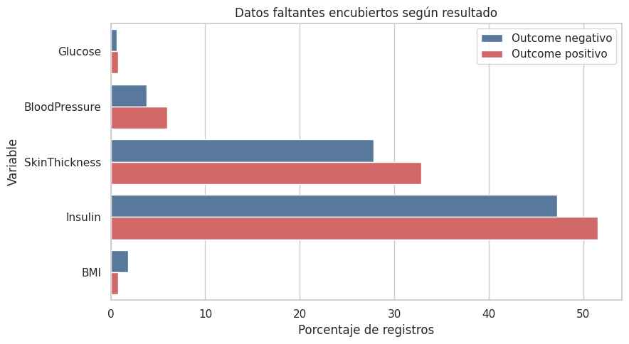
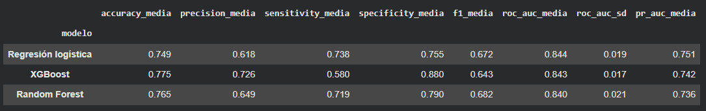
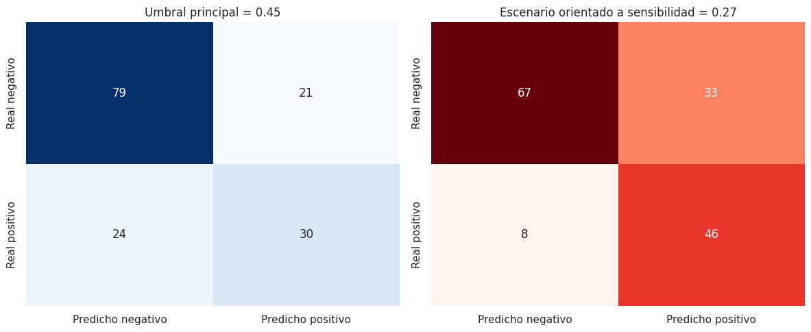

# Diabetes Risk Classification

[Versión en español](README.md)

Data analysis and machine learning project focused on comparing missing-data treatment strategies and classification models using the **Pima Indians Diabetes Dataset**.

The project emphasizes methodological traceability through data-quality auditing, data leakage prevention, stratified cross-validation, probability calibration, classification-threshold selection, and uncertainty estimation.

> This is an educational portfolio project. The model has not been validated for clinical use and must not be used as a diagnostic tool.

## Analytical problem

The dataset contains no explicit `NaN` values, but it includes clinically implausible zeros for glucose, blood pressure, skin thickness, insulin, and body mass index. These zeros were treated as hidden missing values.

The main analytical question was:

> Can the probability of a positive diabetes outcome be estimated without unnecessarily removing a substantial proportion of the records?

## Methodology

1. Audited the dataset structure, duplicate records, class balance, and implausible zero values.
2. Analyzed missing-value percentages, patterns, and associations.
3. Explored feature distributions and Spearman correlations.
4. Created a stratified split: 80% for training and 20% for testing.
5. Compared three missing-data strategies:
   - complete-case analysis;
   - median imputation;
   - median imputation with missingness indicators.
6. Compared a Dummy classifier, logistic regression, Random Forest, and XGBoost.
7. Tuned model hyperparameters using stratified cross-validation.
8. Applied sigmoid calibration and selected classification thresholds using out-of-fold predictions.
9. Performed a single final evaluation on the test set, stratified bootstrap estimation, and coefficient interpretation.

All preprocessing steps were included in pipelines to prevent the imputer or scaler from learning information from validation folds or the test set.

### Hidden missing values



Although the dataset contains no explicit `NaN` values, several measurements include clinically implausible zeros. The issue is particularly important for insulin and skin-thickness measurements.

### Model comparison



The three models achieved similar discrimination. Logistic regression was selected for its balance of performance, sensitivity, stability, and interpretability.

### Confusion matrices



Lowering the classification threshold reduced false negatives while increasing false positives. This illustrates how threshold selection changes the model's potential operational use.

## Key results

Regularized logistic regression was selected for its balance of discrimination, sensitivity, stability, and interpretability. It achieved a mean cross-validated ROC-AUC of approximately `0.844`.

On the held-out test set, the calibrated model achieved:

| Metric | Result |
|---|---:|
| ROC-AUC | 0.812 |
| PR-AUC | 0.671 |
| Brier score | 0.175 |
| Log loss | 0.515 |

The effect of changing the classification threshold was:

| Scenario | Threshold | Sensitivity | Specificity | False negatives | False positives |
|---|---:|---:|---:|---:|---:|
| Primary balance | 0.45 | 0.556 | 0.790 | 24 | 21 |
| Sensitivity-oriented | 0.27 | 0.852 | 0.670 | 8 | 33 |

Lowering the threshold identified positive cases that the primary scenario would have missed, at the cost of additional false positives. Threshold selection therefore depends on the operational cost of each type of error.

## Repository structure

```text
diabetes-risk-classification/
├── README.md
├── README_EN.md
├── data/
│   └── diabetes.csv
├── notebooks/
│   ├── 01_diabetes_eda_calidad_datos.ipynb
│   ├── 02_diabetes_modelado_comparacion_estrategias.ipynb
│   └── 03_diabetes_evaluacion_interpretacion.ipynb
├── images/
│   ├── missing_values.png
│   ├── values_distribution.png
│   ├── values_correlation.png
│   ├── model_comparison.png
│   └── threshold_tradeoff.png
├── requirements.txt
├── .gitignore
└── LICENSE
```

## Notebooks

1. [Data exploration and quality assessment](notebooks/01_diabetes_eda_calidad_datos.ipynb)
2. [Preprocessing strategy and model comparison](notebooks/02_diabetes_modelado_comparacion_estrategias.ipynb)
3. [Final evaluation and interpretation](notebooks/03_diabetes_evaluacion_interpretacion.ipynb)

## Running the project locally

Python 3.10 or later is required.

```bash
git clone https://github.com/dualmapa/diabetes-risk-classification.git
cd diabetes-risk-classification
python -m venv .venv
```

Activate the environment in Windows PowerShell:

```powershell
.venv\Scripts\Activate.ps1
```

Activate the environment in macOS or Linux:

```bash
source .venv/bin/activate
```

Install the dependencies and launch JupyterLab:

```bash
python -m pip install --upgrade pip
pip install -r requirements.txt
jupyter lab
```

Run the notebooks from the repository root and follow their numerical order. They use the relative path `data/diabetes.csv`.

## Technologies

- Python
- pandas and NumPy
- Matplotlib and seaborn
- SciPy
- scikit-learn
- XGBoost
- Jupyter

## Data source

Dataset version used: [Diabetes Dataset on Kaggle](https://www.kaggle.com/datasets/mathchi/diabetes-data-set), released under the **CC0: Public Domain** license.

The dataset represents a specific historical population. Therefore, the results should not be automatically generalized to other populations or clinical settings.

## Limitations

- Small dataset: 768 records, including 154 test observations.
- High proportion of hidden missing values in insulin and skin-thickness measurements.
- The missing-data mechanism cannot be definitively identified from the available information.
- No external, temporal, or institutional validation was performed.
- No subgroup fairness analysis was conducted.
- Model coefficients represent predictive associations, not causal effects.

## Author

**Alexander Marín**  
Data Analyst

## Licenses

The code and documentation in this repository are distributed under the MIT License. The dataset retains the CC0 license specified by its source.
